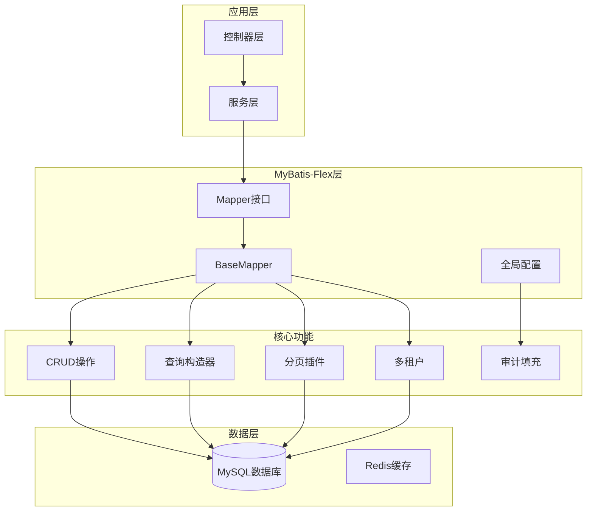

# 🔧 test-MybatisFlex - MyBatis-Flex测试项目


## 📖 项目简介

test-MybatisFlex是MyBatis-Flex框架的测试与学习项目,演示MyBatis-Flex的核心特性,包括基础CRUD、关联查询、多租户、分页等功能。

## 🏗️ 系统架构



## 🚀 快速开始

### 环境要求

- JDK 17+
- Maven 3.6+
- MySQL 8.0+

### 安装步骤

```bash
# 1. 克隆项目
git clone https://github.com/yourusername/test-MybatisFlex.git

# 2. 配置数据库
# 修改 src/main/resources/application.yml
spring:
  datasource:
    url: jdbc:mysql://localhost:3306/mybatis_flex_test
    username: root
    password: your_password

# 3. 初始化数据库
mysql -u root -p < db/schema.sql

# 4. 编译运行
mvn clean install
mvn spring-boot:run

# 5. 测试接口
curl http://localhost:8080/api/users
```

## 🛠️ 技术栈

| 技术 | 版本 | 说明 |
|------|------|------|
| MyBatis-Flex | 1.x | ORM框架 |
| Spring Boot | 3.x | 应用框架 |
| MySQL | 8.0+ | 数据库 |
| Druid | - | 数据库连接池 |
| Hutool | - | Java工具库 |

## 📁 项目结构

```
test-MybatisFlex/
├── src/
│   ├── main/
│   │   ├── java/
│   │   │   └── com/test/mybatisflex/
│   │   │       ├── controller/      # 控制器
│   │   │       ├── service/         # 服务层
│   │   │       ├── mapper/          # Mapper接口
│   │   │       ├── entity/          # 实体类
│   │   │       ├── dto/             # DTO对象
│   │   │       ├── config/          # 配置类
│   │   │       ├── handler/         # 处理器
│   │   │       └── TestApplication.java
│   │   └── resources/
│   │       ├── mapper/              # XML映射文件
│   │       └── application.yml      # 配置文件
│   └── test/                        # 测试代码
├── db/
│   └── schema.sql                   # 数据库脚本
├── pom.xml                          # Maven配置
└── README.md                        # 项目说明
```

## 💡 核心示例

### 实体类定义

```java
@Table("tb_user")
public class User {
    @Id(keyType = KeyType.Auto)
    private Long id;
    
    private String username;
    private String email;
    private Integer age;
    
    @Column(isLogicDelete = true)
    private Boolean isDeleted;
    
    @Column(onInsertValue = "now()")
    private Date createTime;
    
    @Column(onUpdateValue = "now()")
    private Date updateTime;
    
    // getter/setter方法
}
```

### Mapper接口

```java
public interface UserMapper extends BaseMapper<User> {
    // BaseMapper已提供基础CRUD方法
    // 可以自定义复杂查询
    
    @Select("SELECT * FROM tb_user WHERE age > #{age}")
    List<User> selectByAge(@Param("age") Integer age);
    
    List<User> selectByCondition(@Param("username") String username, 
                                 @Param("email") String email);
}
```

### 基础CRUD

```java
@Service
public class UserService {
    
    @Autowired
    private UserMapper userMapper;
    
    /**
     * 插入用户
     */
    public User insert(User user) {
        userMapper.insert(user);
        return user;
    }
    
    /**
     * 批量插入
     */
    public void insertBatch(List<User> users) {
        userMapper.insertBatch(users);
    }
    
    /**
     * 根据ID查询
     */
    public User findById(Long id) {
        return userMapper.selectOneById(id);
    }
    
    /**
     * 查询所有
     */
    public List<User> findAll() {
        return userMapper.selectAll();
    }
    
    /**
     * 更新用户
     */
    public void update(User user) {
        userMapper.update(user);
    }
    
    /**
     * 删除用户
     */
    public void delete(Long id) {
        userMapper.deleteById(id);
    }
}
```

### 查询构造器

```java
@RestController
@RequestMapping("/api/user")
public class UserController {
    
    @Autowired
    private UserMapper userMapper;
    
    /**
     * 条件查询
     */
    @GetMapping("/search")
    public List<User> search(String username, Integer minAge, Integer maxAge) {
        QueryWrapper queryWrapper = QueryWrapper.create()
            .select()
            .from(USER)
            .where(USER.USERNAME.like(username))
            .and(USER.AGE.ge(minAge))
            .and(USER.AGE.le(maxAge))
            .orderBy(USER.CREATE_TIME.desc());
        
        return userMapper.selectListByQuery(queryWrapper);
    }
    
    /**
     * 多表关联查询
     */
    @GetMapping("/{id}/detail")
    public UserDetailVO getUserDetail(@PathVariable Long id) {
        QueryWrapper queryWrapper = QueryWrapper.create()
            .select(USER.ALL_COLUMNS, DEPARTMENT.DEPARTMENT_NAME)
            .from(USER)
            .leftJoin(DEPARTMENT).on(USER.DEPARTMENT_ID.eq(DEPARTMENT.ID))
            .where(USER.ID.eq(id));
        
        return userMapper.selectOneByQueryAs(queryWrapper, UserDetailVO.class);
    }
    
    /**
     * 分组查询
     */
    @GetMapping("/group")
    public List<UserGroupVO> groupByDepartment() {
        QueryWrapper queryWrapper = QueryWrapper.create()
            .select(
                USER.DEPARTMENT_ID,
                USER.AGE.avg().as("avg_age"),
                USER.ID.count().as("user_count")
            )
            .from(USER)
            .groupBy(USER.DEPARTMENT_ID);
        
        return userMapper.selectListByQueryAs(queryWrapper, UserGroupVO.class);
    }
}
```

### 分页查询

```java
@RestController
@RequestMapping("/api/user")
public class UserController {
    
    @Autowired
    private UserMapper userMapper;
    
    /**
     * 分页查询
     */
    @GetMapping("/page")
    public Page<User> page(@RequestParam(defaultValue = "1") Integer pageNum,
                          @RequestParam(defaultValue = "10") Integer pageSize) {
        // 方式1: 使用Page对象
        Page<User> page = userMapper.paginate(
            pageNum, 
            pageSize, 
            QueryWrapper.create().orderBy(USER.CREATE_TIME.desc())
        );
        
        return page;
    }
    
    /**
     * 条件分页
     */
    @GetMapping("/page/search")
    public Page<User> pageSearch(String username, 
                                Integer minAge,
                                @RequestParam(defaultValue = "1") Integer pageNum,
                                @RequestParam(defaultValue = "10") Integer pageSize) {
        QueryWrapper queryWrapper = QueryWrapper.create()
            .where(USER.USERNAME.like(username))
            .and(USER.AGE.ge(minAge))
            .orderBy(USER.CREATE_TIME.desc());
        
        return userMapper.paginate(pageNum, pageSize, queryWrapper);
    }
}
```

### 多租户支持

```java
@Configuration
public class MybatisFlexConfig {
    
    @Bean
    public MybatisFlexCustomizer mybatisFlexCustomizer() {
        return configuration -> {
            // 配置多租户
            configuration.setTenantFactory(() -> {
                // 从上下文中获取租户ID
                return TenantContext.getCurrentTenantId();
            });
        };
    }
}

/**
 * 租户上下文
 */
public class TenantContext {
    private static final ThreadLocal<String> TENANT_ID = new ThreadLocal<>();
    
    public static void setCurrentTenantId(String tenantId) {
        TENANT_ID.set(tenantId);
    }
    
    public static String getCurrentTenantId() {
        return TENANT_ID.get();
    }
    
    public static void clear() {
        TENANT_ID.remove();
    }
}

/**
 * 租户拦截器
 */
@Component
public class TenantInterceptor implements HandlerInterceptor {
    
    @Override
    public boolean preHandle(HttpServletRequest request, 
                            HttpServletResponse response, 
                            Object handler) {
        // 从请求头获取租户ID
        String tenantId = request.getHeader("X-Tenant-Id");
        TenantContext.setCurrentTenantId(tenantId);
        return true;
    }
    
    @Override
    public void afterCompletion(HttpServletRequest request, 
                                HttpServletResponse response, 
                                Object handler, 
                                Exception ex) {
        TenantContext.clear();
    }
}
```

### 逻辑删除

```java
/**
 * 实体类
 */
@Table("tb_user")
public class User {
    @Id(keyType = KeyType.Auto)
    private Long id;
    
    private String username;
    
    @Column(isLogicDelete = true)
    private Boolean isDeleted;
}

/**
 * 使用
 */
@Service
public class UserService {
    
    @Autowired
    private UserMapper userMapper;
    
    /**
     * 逻辑删除
     */
    public void logicDelete(Long id) {
        // 实际执行 UPDATE tb_user SET is_deleted = 1 WHERE id = ?
        userMapper.deleteById(id);
    }
    
    /**
     * 查询会自动过滤已删除数据
     */
    public List<User> findAll() {
        // 实际执行 SELECT * FROM tb_user WHERE is_deleted = 0
        return userMapper.selectAll();
    }
}
```

### 审计填充

```java
/**
 * 实体类
 */
@Table("tb_user")
public class User {
    @Id(keyType = KeyType.Auto)
    private Long id;
    
    @Column(onInsertValue = "now()")
    private Date createTime;
    
    @Column(onUpdateValue = "now()")
    private Date updateTime;
    
    @Column(onInsertValue = "'system'")
    private String createBy;
    
    @Column(onUpdateValue = "'system'")
    private String updateBy;
}

/**
 * 自定义填充处理器
 */
@Component
public class CustomInsertListener implements InsertListener {
    
    @Override
    public void onInsert(Object entity) {
        if (entity instanceof User) {
            User user = (User) entity;
            user.setCreateTime(new Date());
            user.setCreateBy(UserContext.getCurrentUsername());
        }
    }
}
```

### 自定义SQL

```java
/**
 * Mapper接口
 */
public interface UserMapper extends BaseMapper<User> {
    
    /**
     * 自定义查询
     */
    @Select("SELECT * FROM tb_user WHERE username = #{username}")
    User selectByUsername(@Param("username") String username);
    
    /**
     * 复杂查询
     */
    @SelectProvider(type = UserSqlProvider.class, method = "selectByCondition")
    List<User> selectByCondition(UserQuery query);
    
    /**
     * 批量更新
     */
    @Update("<script>" +
            "UPDATE tb_user SET status = 1 WHERE id IN " +
            "<foreach collection='ids' item='id' open='(' separator=',' close=')'>" +
            "#{id}" +
            "</foreach>" +
            "</script>")
    void batchUpdateStatus(@Param("ids") List<Long> ids);
}

/**
 * SQL提供者
 */
public class UserSqlProvider {
    public String selectByCondition(UserQuery query) {
        return new SQL() {{
            SELECT("*");
            FROM("tb_user");
            if (query.getUsername() != null) {
                WHERE("username LIKE '%" + query.getUsername() + "%'");
            }
            if (query.getMinAge() != null) {
                WHERE("age >= " + query.getMinAge());
            }
            ORDER_BY("create_time DESC");
        }}.toString();
    }
}
```

## 📊 MyBatis-Flex vs MyBatis-Plus

| 特性 | MyBatis-Flex | MyBatis-Plus |
|------|--------------|--------------|
| 性能 | 更快 | 快 |
| 查询构造器 | 更灵活 | 固定模式 |
| 多租户 | 原生支持 | 需要插件 |
| 关联查询 | 更强大 | 需要额外配置 |
| 学习成本 | 较低 | 较低 |
| 社区活跃度 | 新兴 | 成熟 |

## 🎯 核心特性

- **零SQL**: 大部分CRUD无需编写SQL
- **高性能**: 比MyBatis-Plus快5-10倍
- **灵活查询**: 强大的查询构造器
- **多租户**: 原生多租户支持
- **审计填充**: 自动填充创建时间、更新时间
- **逻辑删除**: 自动处理逻辑删除
- **乐观锁**: 自动版本控制

## 📝 更新日志

### v1.0.0 (2024-01-01)
- ✨ 初始版本发布
- ✨ 完成基础CRUD测试
- ✨ 完成查询构造器测试
- ✨ 完成分页查询测试
- ✨ 完成多租户测试

## 👥 贡献指南

欢迎贡献代码!请遵循以下步骤:

1. Fork本仓库
2. 创建特性分支 (`git checkout -b feature/AmazingFeature`)
3. 提交更改 (`git commit -m 'Add some AmazingFeature'`)
4. 推送到分支 (`git push origin feature/AmazingFeature`)
5. 提交Pull Request

## 📄 许可证

本项目采用 MIT 许可证 - 查看 [LICENSE](LICENSE) 文件了解详情

## 📮 联系方式

项目维护者: JOSP Team

---

⭐ 如果这个项目对你有帮助,欢迎Star支持!
